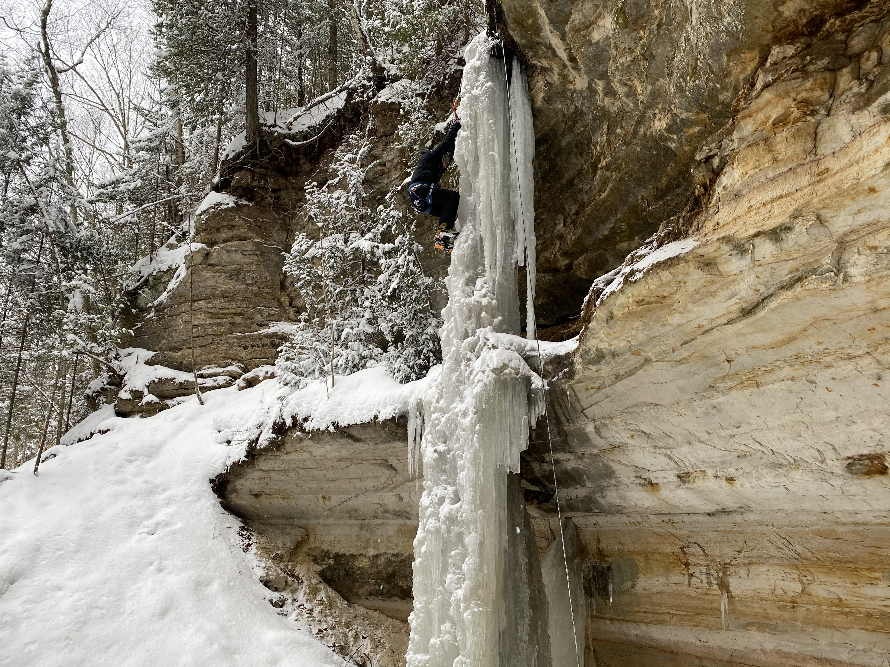
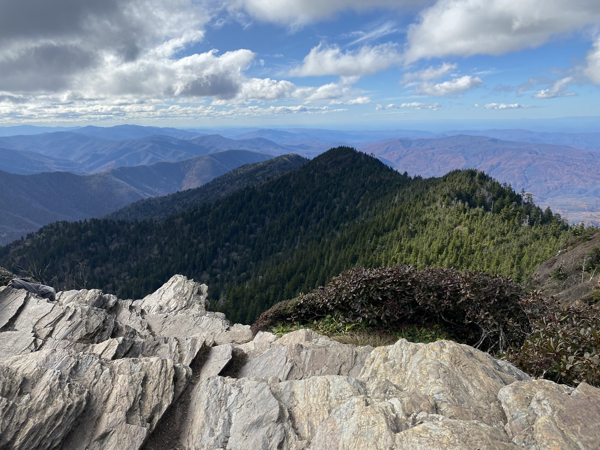
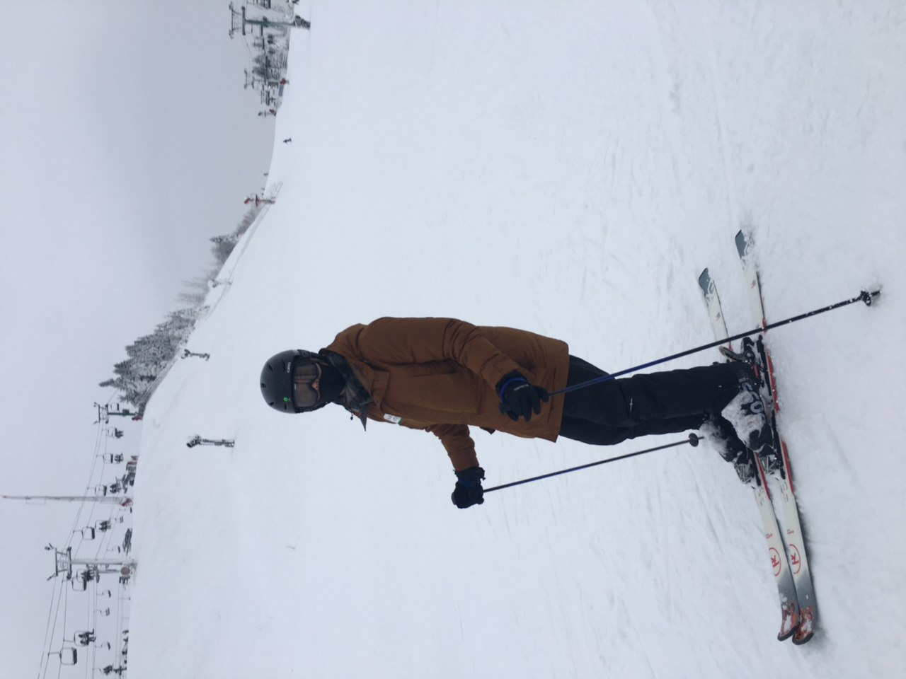

# Hobbies

In my free time, I enjoy <a href="https://gouldju1.github.io/gouldju1/pages/reading-list.html">reading</a>, traveling, cooking and baking, biking, classical music, hiking, and rock/ice climbing.

# Hiking and Climbing

Ice climbing trip to A <a target="_blank" rel="noopener noreferrer"  href="https://www.nps.gov/piro/index.htm">Pictured Rocks National Lakeshore</a> in February 2021.  

Munising Falls in <a target="_blank" rel="noopener noreferrer"  href="https://www.nps.gov/piro/index.htm">Pictured Rocks National Lakeshore</a>, February 2021.  

From a hike in <a target="_blank" rel="noopener noreferrer"  href="https://www.nps.gov/grsm/index.htm">Great Smoky Mountain National Park</a> in November 2020.  

# Winter Activities

Skiing in Michigan in December 2020.  

# Cooking

A <a target="_blank" rel="noopener noreferrer"  href="https://www.bonappetit.com/recipe/raspberry-ricotta-cake">Raspberry-Ricotta Cake</a> I made in summer 2020.  

# Music and Playlists

I have recently been listening to this album:
<figure class="video_container">
<iframe src="https://open.spotify.com/embed/album/3ZlksVEXHUVA2xrxTXEZ7N" width="300" height="380" frameborder="0" allowtransparency="true" allow="encrypted-media"></iframe>
</figure>

I also love opera, and my favorite recording of _Don Giovani_ is:
<figure class="video_container">
<iframe src="https://open.spotify.com/embed/album/3388xieeWLy5YtWME6NW6X" width="300" height="380" frameborder="0" allowtransparency="true" allow="encrypted-media"></iframe>
</figure>